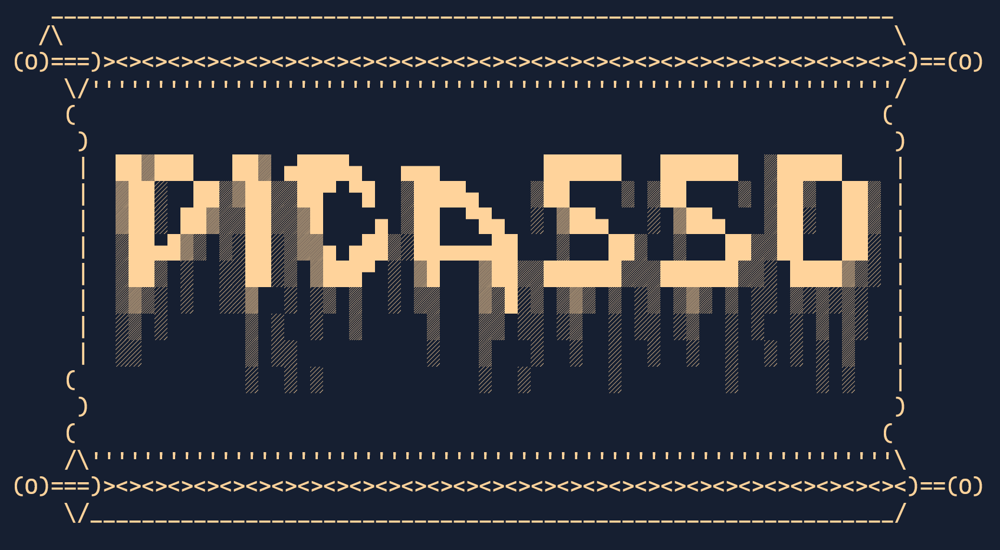

<div align="center">



### `picasso.nvim` lets you effortlessly browse and preview Neovim and Vim color schemes in real-time, making it easy to find the perfect look.

[](http://www.lua.org)
[](https://neovim.io)

</div>

## 😠 The Problem

Re-entering a menu, or re-typing a command every time you want to see a scheme change
can get tedious and frustrating.

## 😊 The Solution

`picasso.nvim`'s menu will stay open and a real-time preview of each color scheme will be shown to you before you pick the one you want.

## 🖌 How Does It Work?:

1. Open the menu and `picasso.nvim` will automatically find all of your installed colors schemes.
2. As you hover though the menu, a preview of each scheme will be shown to you in real-time.
3. When you are satisfied with the scheme, select it using `return`, and it will become your current scheme.
4. The scheme will be saved for the next time you reload Neovim.

NOTE: When closing the menu, the color scheme will always switch back to the Current Scheme
indicated at the top of the menu. Browsing through the menu is just a preview and will not save
the scheme until `return` is pressed on selected scheme

<div align="center">

## Look at that real-time preview functionality!!!


</div>

# 📦 Installation

Install using your preferred plugin manager. Example below is with [Packer](https://github.com/wbthomason/packer.nvim)

`init.lua`

```lua
use 'nvim-lua/plenary.nvim' -- Add this plugin if you don't have it already
use 'harrisonbierman/picasso.nvim'
```

# 🚨IMPORTANT🚨

⚠️ `picasso.nvim` will not work on start up if you already have a color scheme command
running on startup 

`your_config_files.lua`

```lua
vim.cmd.colorscheme('some_color_scheme') -- DON'T DO THIS! BAD!
```

# ⚙️ Setup

⚠️ All settings will default to `false` if they are not set.

`init.lua`

```lua
require('picasso.settings').setup({
	display_vim_schemes = false, -- Shows any installed schemes that are `.vim`
	display_neovim_schemes = true, -- Shows any installed schemes that are `.lua`
	border = 'normal' -- options are: 'normal', 'fun', 'cryptic'. Try them out.
})
```

# ⌨️ Key Binds

Toggle the menu with one key bind.

`init.lua`

```lua
local ui = require('picasso.ui')

vim.keymap.set('n', 'your_keymap_here', function() ui.toggle_menu() end, { noremap = true , silent = true })
```
