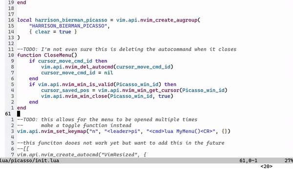

<div align="center">

```text
   _________________________________________________________________
  /\                                                                \
(O)===)><><><><><><><><><><><><><><><><><><><><><><><><><><><><><><><)==(O)
    \/''''''''''''''''''''''''''''''''''''''''''''''''''''''''''''''/
    (                                                              (
     )                                                              )
     |  ██▓███   ██▓ ▄████▄   ▄▄▄        ██████   ██████  ▒█████    |
     |  ▓██░  ██▒▓██▒▒██▀ ▀█  ▒████▄    ▒██    ▒ ▒██    ▒ ▒██▒  ██▒ |
     |  ▓██░ ██▓▒▒██▒▒▓█    ▄ ▒██  ▀█▄  ░ ▓██▄   ░ ▓██▄   ▒██░  ██▒ |
     |  ▒██▄█▓▒ ▒░██░▒▓▓▄ ▄██▒░██▄▄▄▄██   ▒   ██▒  ▒   ██▒▒██   ██░ |
     |  ▒██▒ ░  ░░██░▒ ▓███▀ ░ ▓█   ▓██▒▒██████▒▒▒██████▒▒░ ████▓▒░ |
     |  ▒▓▒░ ░  ░░▓  ░ ░▒ ▒  ░ ▒▒   ▓▒█░▒ ▒▓▒ ▒ ░▒ ▒▓▒ ▒ ░░ ▒░▒░▒░  |
     |  ░▒ ░      ▒ ░  ░  ▒     ▒   ▒▒ ░░ ░▒  ░ ░░ ░▒  ░ ░  ░ ▒ ▒░  | 
     |  ░░        ▒ ░░          ░   ▒   ░  ░  ░  ░  ░  ░  ░ ░ ░ ▒   |
    (             ░  ░ ░            ░  ░      ░        ░      ░ ░   |
     )                                                              )
    (                                                              (
    /\''''''''''''''''''''''''''''''''''''''''''''''''''''''''''''''\    
(O)===)><><><><><><><><><><><><><><><><><><><><><><><><><><><><><><><)==(O)
    \/______________________________________________________________/
```

##### The most satifying way to Hot-Swap your color schemes.

[](http://www.lua.org)
[](https://neovim.io)
</div>

## 🖌 The Problem
You like changing color schemes... A LOT!, but it's is such a draaaaag 
finding the right scheme blind. You type in the name of the 
scheme you think you want just to find out it dosen't cut it. Great!
now you get to type in another scheme and hope this one sparks joy.
If you are like me, you will spend the good part of an hour trying
out color schemes until the feug shui of your IDE emmits a high
order spiritual experience.

## 🖌 The Feeling 
Picking schemes with Picasso feels like grandma came back from the
dead and baked you that warm delicate cookie that everyone else has
tried to replicate, but just couldn't.

## 🖌 How Does It Work?: 
1. Just open the menu and Picasso will automatically find all of your installed colors schemes. 
1. As you hover though the menu, a preview of each scheme will be shown to you in real time.
This is my favorite feature as it makes browsing for schemes easy breasy fun.
1. When you a satified with the scheme, just select, and it becomes your current scheme.

Look at that Hot-Swap!!!


## 🖌  How To Install
Install with your favorite plugin manager. I'm using `Packer` in the example
```lua
use 'nvim-lua/plenary.nvim' -- add this plugin if you dont have it already
use 'harrisonbierman/picasso.nvim'
```

## 🖌 How To Use (Keybinds) 
Currently there is no way to make custom keybind, this is what you will have to do for now.
1. `<leader>pi` opens the Picasso menu
1. `return` sets the scheme you are hovering over to the current scheme
1. `q` quits the Picasso menu

